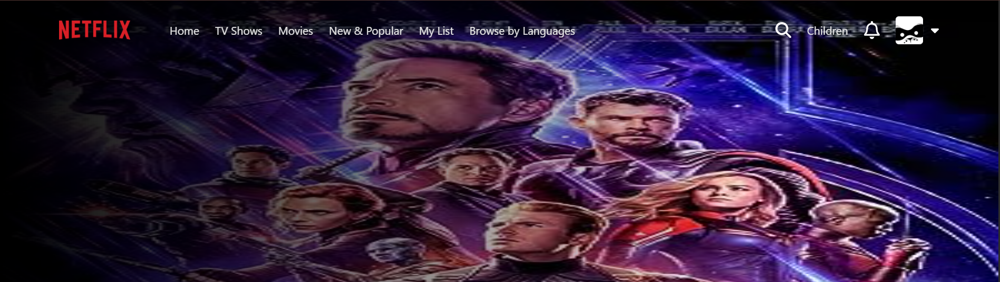
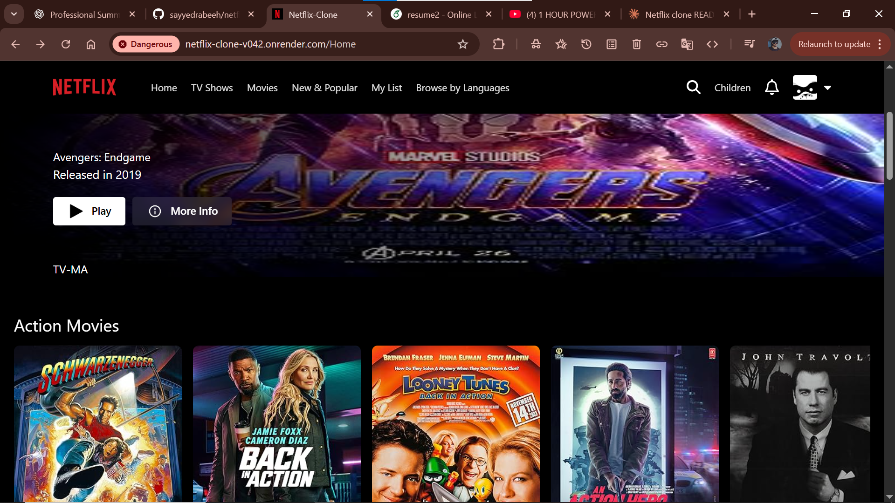
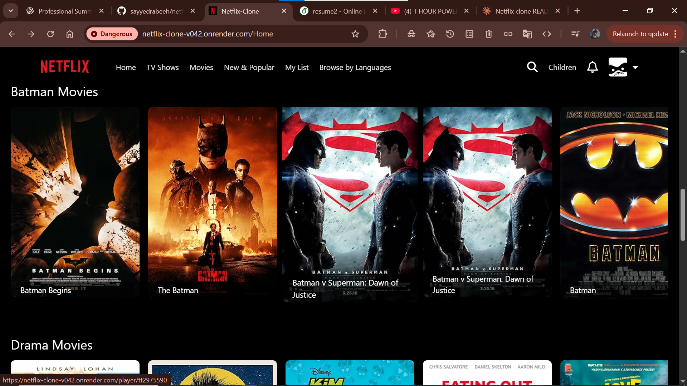
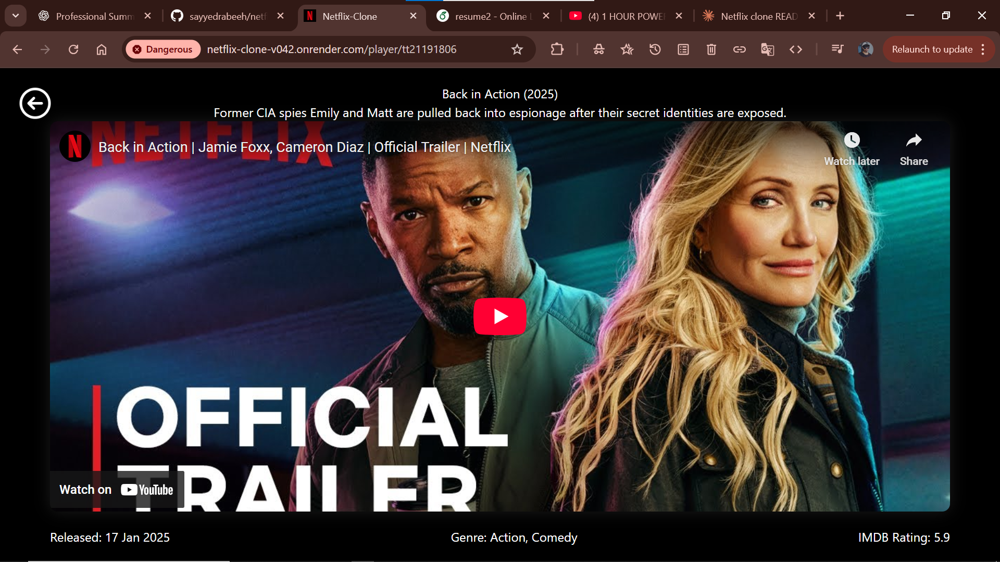

#  Netflix Clone

<div align="center">



[](https://netflix-clone-v042.onrender.com)
[](https://reactjs.org/)
[](https://vitejs.dev/)
[](LICENSE)

**A modern Netflix clone built with React**

[Live Demo](https://netflix-clone-v042.onrender.com) • [Report Bug](https://github.com/sayyedrabeeh/netflix_clone/issues) • [Request Feature](https://github.com/sayyedrabeeh/netflix_clone/issues)

</div>


##  About The Project

<div align="center">
  
</div>

This Netflix clone is a modern, responsive web application that replicates the core features and user interface of Netflix. Built with cutting-edge technologies like React and Vite, it provides a seamless streaming platform experience with real movie data fetched from external APIs.

---

<div align="center">
  
</div>

####  Movie Browsing
- **Dynamic Movie Rows**: Browse movies organized by categories (Trending, Top Rated, Action, Comedy, etc.)
- **Infinite Scrolling**: Smooth horizontal scrolling through movie carousels
- **Hover Effects**: Interactive movie posters with zoom and information preview
- **Category Filters**: Filter content by genre, rating, and release date

####  Video Player

<div align="center">
  
</div>

- **Trailer Playback**: Watch official trailers directly in the app
- **YouTube Integration**: Seamless integration with YouTube API for trailer videos
- **Full-Screen Mode**: Immersive viewing experience
- **Auto-Play Banner**: Featured content with auto-playing trailers on mute
 

 
 
 
### APIs & Services


### Deployment


 
---
 
##  Getting Started

### Prerequisites

Before you begin, ensure you have the following installed:

- **Node.js** (v16.x or higher)
  ```bash
  node --version
  ```

- **npm** or **yarn**
  ```bash
  npm --version
  # or
  yarn --version
  ```

- **Git**
  ```bash
  git --version
  ```
 
---

##  Installation

Follow these steps to get the project running on your local machine:

### 1. Clone the Repository

```bash
git clone https://github.com/sayyedrabeeh/netflix_clone.git
```

### 2. Navigate to Project Directory

```bash
cd netflix_clone
```

### 3. Install Dependencies

Using npm:
```bash
npm install
```

Or using yarn:
```bash
yarn install
```

### 4. Set Up Environment Variables

Create a `.env` file in the root directory:

```bash
touch .env
```

Add your API keys (see [Environment Variables](#environment-variables) section):

```env
VITE_TMDB_API_KEY=your_tmdb_api_key_here
VITE_YOUTUBE_API_KEY=your_youtube_api_key_here
```

### 5. Start Development Server

```bash
npm run dev
```

The application will open at `http://localhost:5173`

### 6. Build for Production

```bash
npm run build
```

### 7. Preview Production Build

```bash
npm run preview
```

---
 
## 📁 Project Structure

```
netflix_clone/
├── netflix_clone/              # Main application directory
│   ├── public/                 # Static assets
│   │   ├── favicon.ico
│   │   └── netflix-logo.png
│   │
│   ├── src/                    # Source files
│   │   ├── assets/            # Images, icons, fonts
│   │   │   ├── images/
│   │   │   └── icons/
│   │   │
│   │   ├── components/        # React components
│   │   │   ├── Banner/
│   │   │   │   ├── Banner.jsx
│   │   │   │   └── Banner.css
│   │   │   │
│   │   │   ├── Nav/
│   │   │   │   ├── Nav.jsx
│   │   │   │   └── Nav.css
│   │   │   │
│   │   │   ├── Row/
│   │   │   │   ├── Row.jsx
│   │   │   │   └── Row.css
│   │   │   │
│   │   │   └── Footer/
│   │   │       ├── Footer.jsx
│   │   │       └── Footer.css
│   │   │
│   │   ├── pages/             # Page components
│   │   │   ├── Home/
│   │   │   │   ├── Home.jsx
│   │   │   │   └── Home.css
│   │   │   │
│   │   │   └── Search/
│   │   │       ├── Search.jsx
│   │   │       └── Search.css
│   │   │
│   │   ├── services/          # API services
│   │   │   ├── api.js
│   │   │   ├── requests.js
│   │   │   └── youtube.js
│   │   │
│   │   ├── utils/             # Utility functions
│   │   │   ├── constants.js
│   │   │   └── helpers.js
│   │   │
│   │   ├── hooks/             # Custom React hooks
│   │   │   └── useMovies.js
│   │   │
│   │   ├── App.jsx            # Main App component
│   │   ├── App.css            # Global styles
│   │   ├── main.jsx           # Entry point
│   │   └── index.css          # Base styles
│   │
│   ├── .env.example           # Example environment file
│   ├── .gitignore            # Git ignore rules
│   ├── index.html            # HTML template
│   ├── package.json          # Dependencies
│   ├── vite.config.js        # Vite configuration
│   └── README.md             # Project documentation
│
├── node_modules/              # Dependencies (not in repo)
├── package.json              # Root package file
└── package-lock.json         # Dependency lock file
```

**This is a non-commercial, educational project.**

---

<div align="center">

### ⭐ If you found this project helpful, please consider giving it a star!

**Made with ❤️ by [Sayyed Rabeeh](https://github.com/sayyedrabeeh)**

[⬆ Back to Top](#-netflix-clone)

</div>